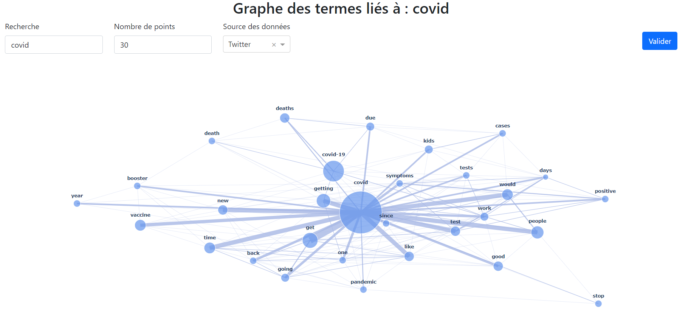

# Network graph of words from tweets and scientific papers

## Goals
Create a network graph of words related to a subject. By taking data from two very different websites : arXiv for the scientific papers and Twitter for tweets, the goal is to see the differences of vocabulary between those two sources.

## Process
1. Getting the data from arXiv and Twitter using their APIs
2. Clean the data and remove the useless words from the texts
3. Processing this data to get the most frequently used words
4. Create the network graph
5. Create the interface to interact with the graph

